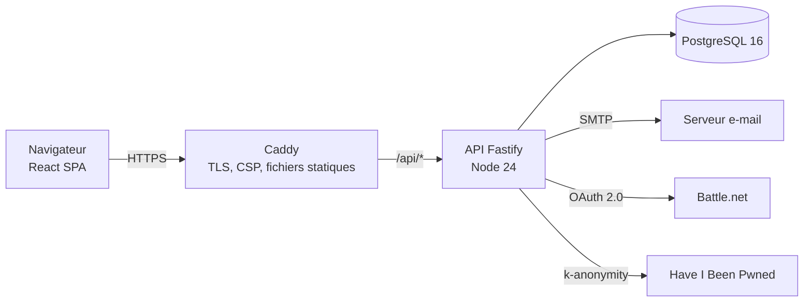
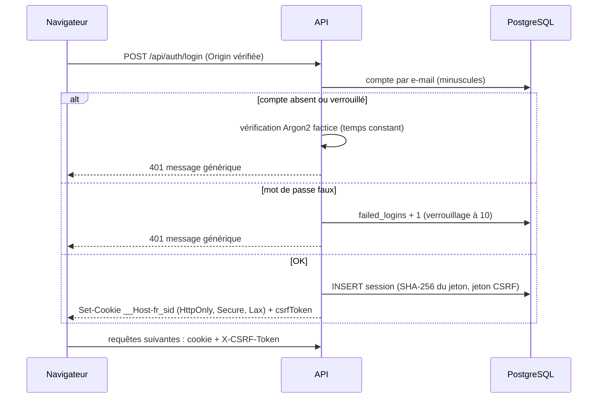
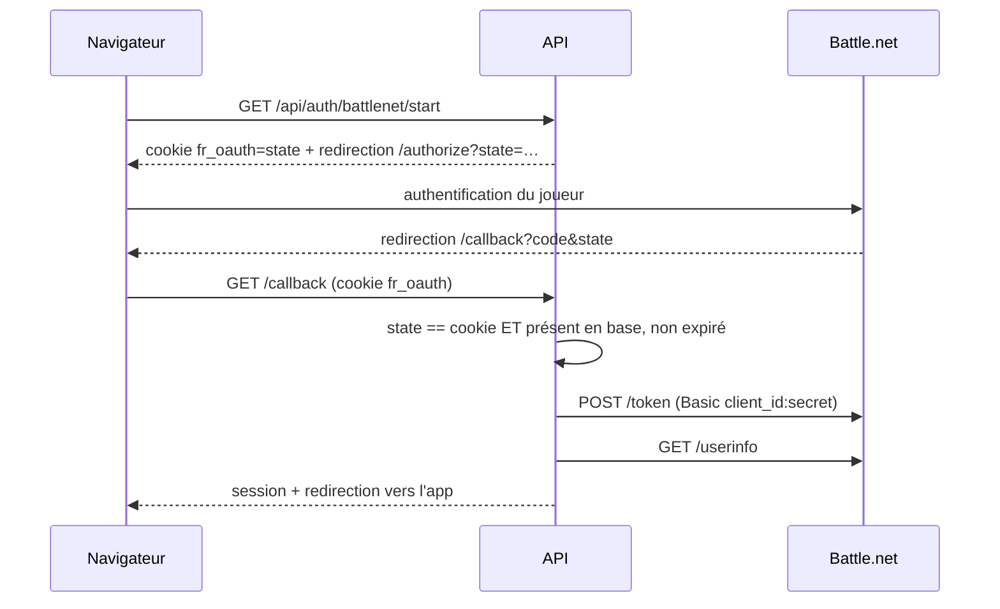
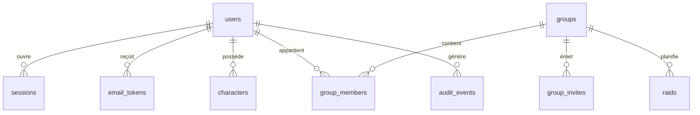

# Architecture

## Vue d'ensemble

Le front et l'API partagent la même origine (Caddy en production, le proxy de Vite en développement). Cela permet des cookies `SameSite=Lax` sans configuration CORS.

## Un site, deux adresses

Forever Roster (`APP_ORIGIN`, jeu `forever`) et Roster (`RETAIL_ORIGIN`, jeu `retail`, WoW Retail) sont le même site : même code, même base, mêmes comptes. Le nom d'hôte de la requête désigne le site (`apps/api/src/lib/site.ts`, `siteOf(req)`, repli sur Forever Roster) :

- contrôle d'origine (CSRF) : l'en-tête `Origin` doit être l'adresse du site demandé ;
- e-mails, liens d'invitation et d'annonce Discord, retour OAuth (Discord, Battle.net) : adresse et nom du site concerné ;
- persos et groupes ont une colonne `game` : chaque adresse ne liste et ne crée que ceux de son jeu, et un perso ne rejoint qu'un groupe du même jeu ;
- le cookie de session (`__Host-`) reste propre à chaque adresse : on se connecte une fois sur chacune.

Le front lit `GET /api/site` (nom, jeu, ouvert ou non, autre adresse) pour son nom, son logo et sa couleur. Caddy sert à la racine `/` une page d'accueil statique propre à chaque adresse (`apps/web/public/landing/`), lisible par les moteurs de recherche ; un visiteur déjà connecté y est renvoyé vers ses persos. Un seul bot Discord sert les deux sites (`/forever-lier` et `/roster-lier`).

## Connexion par mot de passe

## Connexion Battle.net

## Modèle de données

- `characters.game` et `groups.game` : `forever` ou `retail` (voir « Un site, deux adresses »).
- Compte des objets reçus (lot I) : calculé à la demande depuis `raid_logs.loot` sur la période du groupe (`groups.loot_settings`), moins `loot_exclusions` (objet sorti du compte, repéré par raid, objet, receveur et heure : un nouveau collage du bilan le garde), plus `loot_corrections` (± avec motif, datées).

- `characters.professions`, `gear` et `legacy` sont en JSONB : leur structure est validée par zod à l'entrée et typée côté Drizzle.
- `raids.slots` est un tableau JSONB `{group, pos, characterId}`. L'API vérifie à chaque écriture que les personnages appartiennent à des membres du groupe.

## Paquet `@forever/game-data`

Source unique pour les races, classes, spés, métiers, emplacements d'équipement et règles de raid. L'API l'utilise pour valider les données et calculer la couverture d'un raid. Le front l'utilise pour les formulaires et pour recalculer la couverture en direct pendant le glisser-déposer. Il est distribué en TypeScript et embarqué dans le bundle de l'API par tsup.

## Pistes pour la suite

- Simulations DPS : un module `packages/sim` pourra réutiliser `game-data` (classes, spés, talents) et l'équipement déjà stocké.
- Double authentification TOTP puis WebAuthn.
- Import des personnages depuis l'API de profil Battle.net (scope `wow.profile`) dès que Forever y sera exposé.
