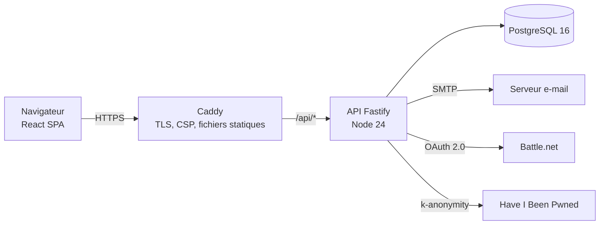
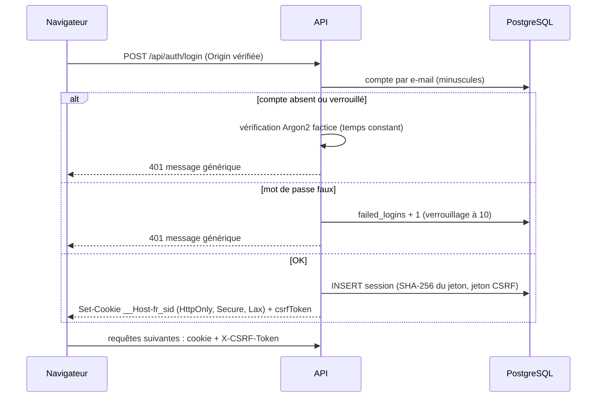
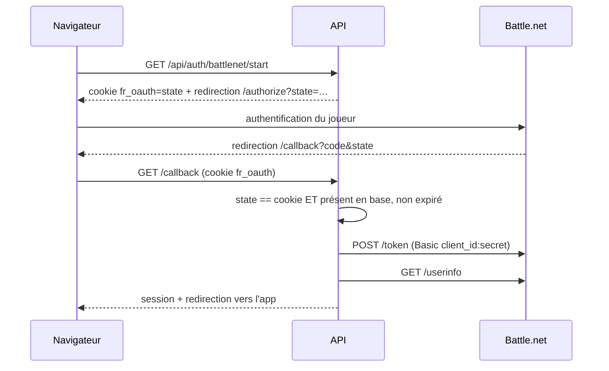
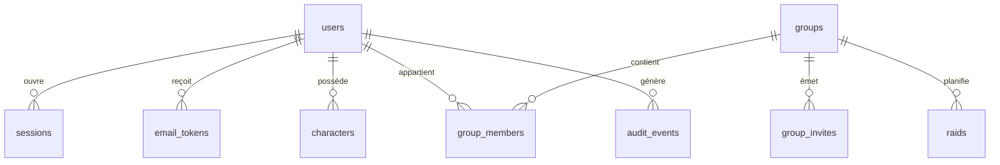
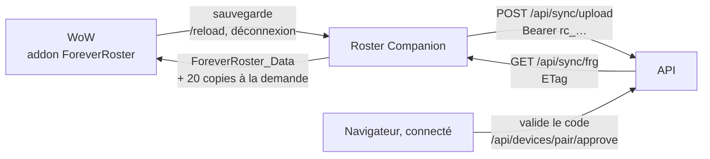

# Architecture

## Vue d'ensemble

Le front et l'API partagent la même origine (Caddy en production, le proxy de Vite en développement). Cela permet des cookies `SameSite=Lax` sans configuration CORS.

## Un site, deux adresses

Forever Roster (`APP_ORIGIN`, jeu `forever`) et Roster (`RETAIL_ORIGIN`, jeu `retail`, WoW Retail) sont le même site : même code, même base, mêmes comptes. Le nom d'hôte de la requête désigne le site (`apps/api/src/lib/site.ts`, `siteOf(req)`, repli sur Forever Roster) :

- contrôle d'origine (CSRF) : l'en-tête `Origin` doit être l'adresse du site demandé ;
- e-mails, liens d'invitation et d'annonce Discord, retour OAuth (Discord, Battle.net) : adresse et nom du site concerné ;
- persos et groupes ont une colonne `game` : chaque adresse ne liste et ne crée que ceux de son jeu, et un perso ne rejoint qu'un groupe du même jeu ;
- le cookie de session (`__Host-`) reste propre à chaque adresse : on se connecte une fois sur chacune.

Données par jeu (`packages/game-data/src/games.ts`) : classes, spés, niveau maximum et buffs de raid de chaque jeu (`classesOf`, `specsOf`, `effectsOf`…). Roster a les 13 classes et 40 spés de Retail (`retail.ts`, clés anglaises, noms français), les raids de Midnight et leurs difficultés : `formatFor(game, nom, effectif, difficulté)` (`routes/raids.ts`) vérifie l'effectif (Normal et Héroïque 10 à 30, Mythique 20, flexible 15 à 25 pour Kith'ix et Chute-des-Spores). Les clés stockées restent en anglais ; l'affichage passe par `useGameText()` (site) : noms traduits sur Roster selon `users.game_lang` (`auto` : langue du navigateur). Roster fermé (`SITE_INFO.retail.open = false`) s'ouvre pour les comptes `users.roster_preview` (commande `roster-preview`).

Import Battle.net (R2b, `lib/blizzard.ts`, `routes/battlenet-import.ts`) : l'OAuth Battle.net a un troisième mode, `bnet_import` (scope `openid wow.profile`, seulement sur Roster) ; au retour, `GET /profile/user/wow` avec le jeton du joueur (jamais stocké) remplit `bnet_imports` pour 30 min. `POST /api/battlenet/import` crée ou relie les fiches (`characters.bnet_id`, `realm_slug`), puis lit chaque profil public avec un jeton d'application (client credentials, gardé en mémoire jusqu'à son expiration) : `ilvl`, `active_spec`, `bnet_synced_at`. Mises à jour à la demande seulement (fiche, ou groupe pour les officiers, 4 requêtes à la fois). En test, Blizzard est simulé (`fetchMock` dans l'API, `e2e/blizzard-mock.mjs` en bout en bout).

Le front lit `GET /api/site` (nom, jeu, ouvert ou non, autre adresse) pour son nom, son logo et sa couleur. Caddy sert à la racine `/` une page d'accueil statique propre à chaque adresse (`apps/web/public/landing/`), lisible par les moteurs de recherche ; un visiteur déjà connecté y est renvoyé vers ses persos. Un seul bot Discord sert les deux sites (`/forever-lier` et `/roster-lier`).

## Connexion par mot de passe

## Connexion Battle.net

## Modèle de données

- `characters.game` et `groups.game` : `forever` ou `retail` (voir « Un site, deux adresses »).
- Roster Companion (lot K1) : `devices` (un jeton haché par appareil relié), `device_pairings` (demandes d'appairage en cours), `addon_ignored` (persos du jeu que le joueur a choisi d'ignorer), `characters.addon_key` (perso du jeu « Prénom-Royaume » lié à la fiche, unique par compte et par jeu) et `raid_logs.lead` (bilan relevé par le chef de raid).
- Compte des objets reçus (lot I) : calculé à la demande depuis `raid_logs.loot` sur la période du groupe (`groups.loot_settings`), moins `loot_exclusions` (objet sorti du compte, repéré par raid, objet, receveur et heure : un nouveau collage du bilan le garde), plus `loot_corrections` (± avec motif, datées).

- `characters.professions`, `gear` et `legacy` sont en JSONB : leur structure est validée par zod à l'entrée et typée côté Drizzle.
- `raids.slots` est un tableau JSONB `{group, pos, characterId}`. L'API vérifie à chaque écriture que les personnages appartiennent à des membres du groupe.

## Roster Companion (appli de bureau)

Appli Tauri 2 pour Windows (`apps/companion`, hors des espaces de travail npm : elle a son propre `package-lock.json` et un espace de travail Cargo). Le cœur en Rust (`rc-core`) ne dépend pas de la fenêtre et se teste seul ; l'appli (`src-tauri`) ajoute l'icône près de l'horloge, la fenêtre (interface React) et une boucle de fond. Détails : [apps/companion/README.md](../apps/companion/README.md).

Côté serveur, `routes/devices.ts` (appairage, appareils reliés) et `routes/sync.ts` (envoi, relevé, persos ignorés) passent par le même import que le Ctrl+V (`lib/addon-import.ts`).

## Paquet `@forever/game-data`

Source unique pour les races, classes, spés, métiers, emplacements d'équipement et règles de raid. L'API l'utilise pour valider les données et calculer la couverture d'un raid. Le front l'utilise pour les formulaires et pour recalculer la couverture en direct pendant le glisser-déposer. Il est distribué en TypeScript et embarqué dans le bundle de l'API par tsup.

## Pistes pour la suite

- Simulations DPS : un module `packages/sim` pourra réutiliser `game-data` (classes, spés, talents) et l'équipement déjà stocké.
- Double authentification TOTP puis WebAuthn.
- Import des personnages depuis l'API de profil Battle.net (scope `wow.profile`) dès que Forever y sera exposé.
